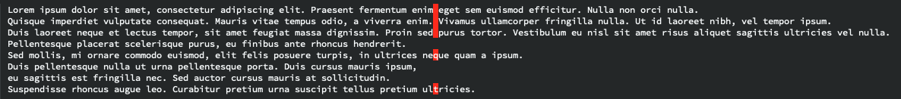

# Whitespace character

Whitespace hack for highlighting characters at column.



## Install

Add `whitespace-character.el` in your load path

## Usage

```
(whitespace-character-mode t)
(setq whitespace-line-column 80
      whitespace-style '(character ...))
```

## Customization

The font face of the highlighted character is customizable thanks to `whitespace-character` in the `whitespace` variables group (`M-x customize`)
